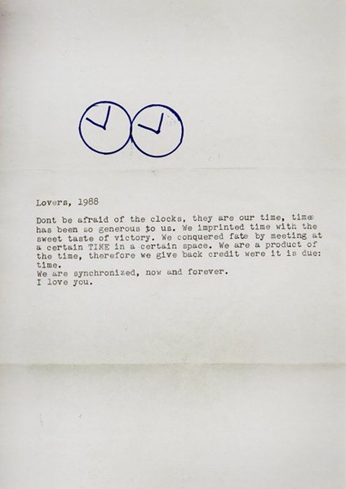
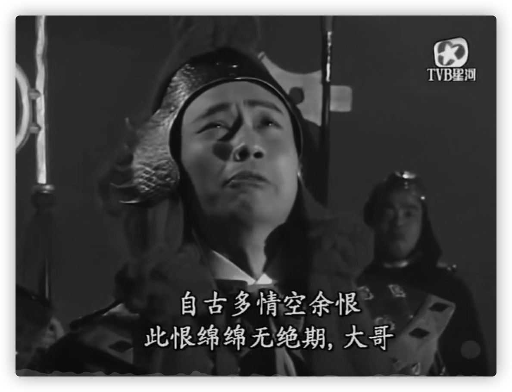
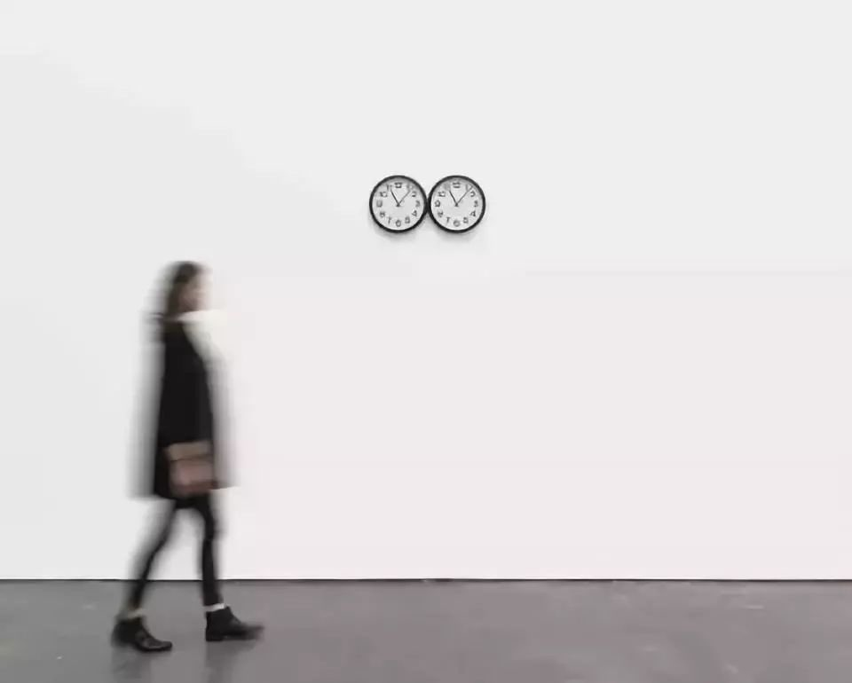
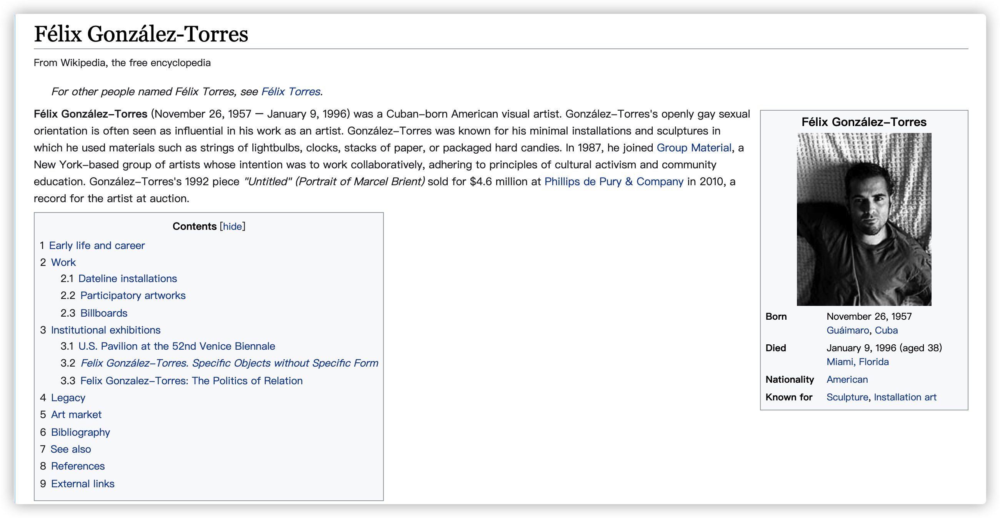
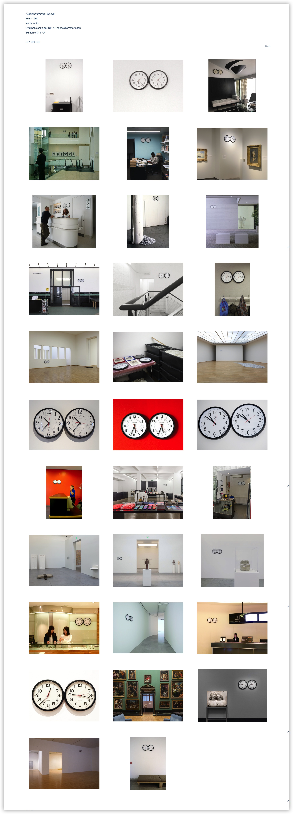

> L'amour n'est pas éternel, mais il y a l'éternité

&emsp;&emsp;人们传统观念里代表爱的符号是给爱人带上的戒指，情人节送的玫瑰花等等，记得以前和一位心理学专业的朋友曾经讨论过为什么情侣间要互相赠送礼物这个问题，给了我一个至今仍然觉得非常恰当的回答「爱需要载体啊」，当然并不是越贵重的礼物承载的爱就越多，这就容易走上形而上学的路子了，举个例子：情侣间最常说的一句是「我爱你」，诚然，语言是有力量的，如果加上这么个场景，清晨要去上班的你在出门前给你另外一半一个Kiss,画面感是不是开始产生了，这时候，如果刚好这时给你递上一份早餐，说路上吃，别饿着，那么这份早餐就是「爱的载体」，并不贵重但满含爱意。

&emsp;&emsp;嘀嗒，嘀嗒，会不会有永恒的爱呢，我回答不了，在意外中看到了[Felix Gonzalez-Torres](https://www.felixgonzalez-torresfoundation.org/#)在1991年的作品---「Perfect Lovers」,倒是让我体会到了爱虽不存在着永远但有永恒，比较恰当的表述应该可以用苏轼的 “十年生死两茫茫，不思量，自难忘”。
从时针、分针到秒针，墙上挂着的是两个完全同步的时钟，也象征着从心跳到行动都完美契合的恋人。行走的步姿、饮食的口味、审美的相似乃至思想的投契。有时，我们寻找「完美恋人」的标准，仿佛变成了寻找另一个「自己」。两个最初设置为同一时间的时钟，完美的一致，完美的对称，一切都是完美的，然而电子时钟始终会有一天电池会用尽，或者是如果它们两个均停止在同一时间的话，会是一件很美的事情，就像一对爱人，不论生与死都永远在一起一样，生死相依，但也有可能是其中一个会先停止行走的分针，另外一个只能迈着步子继续前进。

1988年，Félix曾在一封信上，写下了自己对于永恒的「时间」与「爱」之间的感受：

Don’t be afraid of the clocks, they are our time, time has been so generous to us. We imprinted time with the sweet taste of victory. We conquered fate by meeting at a certain TIME in a certain space. We are a product of the time, therefore we give back credit where it is due: time.
We are synchronized, now and forever.
I love you.

（不要害怕时钟，那是专属我们的时间。时间对我们是如此的慷慨。我们把胜利的甜蜜镌刻在时间里，我们征服了命运，在特定的时间和空间中相遇。我们是时间的产物，所以我们应该要称赞它。我们是同步的，现在和永远，我爱你。）

这时的你或许会觉得Félix这时候肯定是处于热恋期，事实上，此时的Félix已经是激情归于平淡，体会爱情为何的人，用我最喜欢八戒的一句：

----有兴趣的小伙伴可以[click](https://www.bilibili.com/video/BV1jW411Y7vk?from=search&seid=4879691198350067625&spm_id_from=333.337.0.0)这里看完整版～～

&emsp;&emsp;扯远了差点离题，「Perfect Lovers」的创作背景是Felix Gonzalez-Torres在得知他的同性爱人Ross Lawcock患上艾滋病后，在他爱人离世前不久创造了这个作品，不久他也因艾滋病离开了。作品摆设在在淡蓝色的背景下，Gonzalez Torres说：“对我来说，如果一段美丽的记忆可以用一种颜色来形容，它将是淡蓝色。”

> “我们就像两个步调一致的时钟，永远并肩而行。”

&emsp;&emsp;Felix Gonzalez-Torres（冈萨雷斯-托雷斯）出生于古巴，同性恋视觉艺术家，雕塑家，观念艺术家。
20世纪70年代晚期定居于纽约，在这里，他学习了艺术并开始进行他的艺术实践，直到1996年他因艾滋病并发症而去世，享年38岁。他在20世纪80年代时加入了艺术组合“Group Material”，是一名活跃的社会积极分子，并在一段相对较短的时间里创作了一些具有深刻影响力的作品。这些作品与概念艺术及极简主义艺术都具有决定性的关系，它们将政治评论、情感影响以及形式上的深刻关系融入到各种媒介之中——包括绘画、雕塑以及公共广告牌等。他通常将普通的物品用作出发点：钟表、镜子或是灯具等。这些作品都具有一种不稳定性以及改变的可能性。————Wikipedia

&emsp;&emsp;一对时钟又可以是两面镜子，对称的偶数在Félix的创作中最为常见。艺术评论家Nicolas Bourriaud曾这样形容作品所带来的感受：从来都不是用「一个」来表示孤独，而是用「另一个」的缺席来表示。

> “The feeling of loneliness is never represented by the “I”, but the absence of the“2”.”

&emsp;&emsp;即使知道最深刻的爱依旧敌不过时间，再长久的陪伴也会迎来分离，甚至所有的偶数最终都会归于单数，Félix仍想感谢时间的慷慨，让他和恋人能够在有限的生命中相遇、相识、相爱与相伴。

完整「Perfect Lovers」系列可以[clik here](https://www.felixgonzalez-torresfoundation.org/works/untitled-perfect-lovers)

